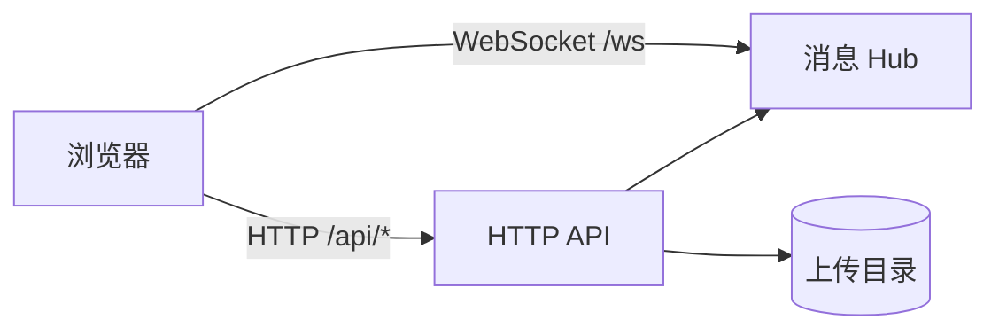

# LanRoom

跨设备的文字与文件互传工具。一个 Go 单文件服务端 + 浏览器页面，Android、iOS、Windows、macOS、Linux 打开网页即可加入，无需安装任何客户端。

- **局域网模式**（默认）：在家里或办公室的一台电脑 / NAS 上运行，同一 Wi‑Fi 下的设备扫码加入。
- **公网模式**：部署到自己的服务器，通过 Nginx + HTTPS 用域名访问，设备不必在同一网络。

---

## 目录

- [功能](#功能)
- [快速开始](#快速开始)
- [部署](#部署)
  - [局域网：Docker](#局域网docker)
  - [公网服务器：Nginx + HTTPS](#公网服务器nginx--https)
- [配置](#配置)
- [安全模型](#安全模型)
- [限制](#限制)
- [API](#api)
- [架构](#架构)
- [开发](#开发)
- [常见问题](#常见问题)
- [许可证](#许可证)

---

## 功能

| 功能 | 说明 |
|------|------|
| 群聊 | 基于 WebSocket 的实时文字消息 |
| 文件与图片 | 分片上传，显示进度与速度，可取消；图片可全屏预览 |
| 断点续传 | 网络抖动自动重试并从断点继续；刷新页面后重新选择同一文件也能续传 |
| 私信 | 点击在线设备即可单独发送文字、文件、粘贴内容或拖拽文件 |
| 房间口令 | 可选（公网模式强制）；已登录设备展示的二维码自带口令，扫码即进 |
| 扫码加入 | 「连接信息」弹窗生成加入地址二维码 |
| 断线重连 | 自动重连；设备身份保存在浏览器，刷新后仍是同一台设备 |
| 消息历史 | 默认保留 1 小时，新加入的设备可回看群聊 |
| 平台适配 | 按 Android / iOS / Windows / macOS / Linux 调整界面与交互 |

---

## 快速开始

需要 Go 1.26+（或 Go 1.21+ 并允许 `GOTOOLCHAIN=auto` 自动下载工具链）。

```bash
git clone <repo-url> lanroom && cd lanroom
go run .                     # 默认监听 :8787
```

浏览器打开 `http://127.0.0.1:8787`，输入昵称进入。其他设备点页面上的「连接信息」扫描二维码，或手动访问 `http://<本机局域网 IP>:8787`。

编译为单文件：

```bash
go build -o lanroom .
./lanroom -port 8787
```

前端资源通过 `go:embed` 打包进二进制，运行时不依赖任何外部文件。

---

## 部署

### 局域网：Docker

**Host 网络（Linux 推荐）**：容器直接使用宿主机网络，能自动识别局域网 IP。

```bash
docker compose -f docker-compose.host.yml up -d --build
```

**Bridge 端口映射**（macOS / Windows 的 Docker Desktop 不支持 host 网络时使用）：

```bash
LANROOM_ADVERTISE_IP=192.168.1.10 docker compose up -d --build
```

Bridge 模式下容器看不到宿主机网卡，需要用 `LANROOM_ADVERTISE_IP` 指定二维码中展示的宿主机 IP。

常用设置写在项目目录的 `.env` 中，Docker Compose 会自动读取：

```dotenv
LANROOM_PIN=2468
LANROOM_RETENTION=24h
LANROOM_MAX_UPLOAD_MB=2048
```

上传文件保存在 Docker 卷 `lanroom-uploads`（容器内 `/data/uploads`）。容器配置了 `restart: unless-stopped`，Docker 开机自启后服务会随之启动。

### 公网服务器：Nginx + HTTPS

设置 `LANROOM_PUBLIC_URL` 后进入公网模式：

- 加入地址与二维码使用公网地址，不再展示服务器内网 IP；
- 必须设置 `LANROOM_PIN`，否则拒绝启动（少于 8 位会输出警告）；
- 通过 HTTPS 访问时，登录 cookie 带 `Secure` 标记。

推荐拓扑：Nginx 监听 80/443 并终止 TLS，反向代理到只监听 `127.0.0.1:8787` 的 LanRoom。8787 端口不对公网开放。

```
浏览器 ──HTTPS/WSS──▶ Nginx :443 ──HTTP──▶ LanRoom 127.0.0.1:8787
```

**1. 域名与证书**

将域名解析到服务器，防火墙放行 80 与 443，然后申请证书：

```bash
sudo certbot certonly --nginx -d drop.example.com
```

**2. 配置 Nginx**

复制示例配置 [`deploy/nginx/lanroom.conf`](deploy/nginx/lanroom.conf)，把其中的 `drop.example.com` 替换为你的域名：

```bash
sudo cp deploy/nginx/lanroom.conf /etc/nginx/conf.d/lanroom.conf
sudo nginx -t && sudo systemctl reload nginx
```

Nginx 早于 1.25.1 时，删除 `http2 on;`，改为 `listen 443 ssl http2;`。

如需自行编写配置，以下几项不可省略：

| 配置 | 用途 |
|------|------|
| `proxy_http_version 1.1`，转发 `Upgrade` / `Connection` 头 | WebSocket |
| `proxy_set_header Host $host` | 服务端据此校验 WebSocket 的 Origin |
| `X-Forwarded-For $remote_addr`，`X-Forwarded-Proto $scheme` | 识别真实客户端 IP 与 HTTPS |
| `client_max_body_size 0`，`proxy_request_buffering off`，`proxy_buffering off` | 大文件流式上传与下载，大小上限由 LanRoom 控制 |
| `proxy_read_timeout 3600s` | 慢速网络上传与空闲 WebSocket |

**3. 启动 LanRoom**

```bash
cat >> .env <<'EOF'
LANROOM_PUBLIC_URL=https://drop.example.com
LANROOM_PIN=<足够长的口令>
EOF
docker compose -f docker-compose.server.yml up -d --build
```

[`docker-compose.server.yml`](docker-compose.server.yml) 使用 host 网络，并已设置 `LANROOM_LISTEN=127.0.0.1:8787` 与 `LANROOM_TRUSTED_PROXIES=127.0.0.1,::1`。

不使用 Docker 时：

```bash
LANROOM_PUBLIC_URL=https://drop.example.com \
LANROOM_PIN=<足够长的口令> \
LANROOM_LISTEN=127.0.0.1:8787 \
LANROOM_TRUSTED_PROXIES=127.0.0.1,::1 \
LANROOM_UPLOAD_DIR=/var/lib/lanroom \
./lanroom
```

**4. 验证**

```bash
curl -s https://drop.example.com/api/info | jq '{joinUrl, pinRequired}'
# { "joinUrl": "https://drop.example.com", "pinRequired": true }
```

---

## 配置

所有配置通过环境变量设置，命令行参数只有两个。

| 命令行参数 | 说明 | 默认 |
|------------|------|------|
| `-port` | 监听端口 | `8787` |
| `-addr` | 完整监听地址，如 `127.0.0.1:8787`；优先于 `-port` 与 `LANROOM_LISTEN` | 空 |

| 环境变量 | 说明 | 默认 |
|----------|------|------|
| `LANROOM_PIN` | 房间口令，为空表示不启用 | 空 |
| `LANROOM_RETENTION` | 消息历史与上传文件的保留时长，Go duration 格式（`30m`、`24h`），最短 `1m` | `1h` |
| `LANROOM_MAX_UPLOAD_MB` | 单文件上传上限（MiB），最大 `4096` | `500` |
| `LANROOM_UPLOAD_DIR` | 上传文件目录 | `<系统临时目录>/three-end-transmission-uploads` |
| `LANROOM_ADVERTISE_IP` | 局域网模式下展示的 IP（逗号分隔），用于 Docker bridge 或多网卡 | 自动检测 |
| `LANROOM_PUBLIC_URL` | 公网访问地址，如 `https://drop.example.com`；不能包含路径。设置后进入公网模式 | 空 |
| `LANROOM_LISTEN` | 监听地址，放在反向代理后时设为 `127.0.0.1:8787` | `:<port>` |
| `LANROOM_TRUSTED_PROXIES` | 可信反向代理的 IP 或 CIDR（逗号分隔）。只有来自这些地址的请求才读取 `X-Forwarded-For`、`X-Real-IP`、`X-Forwarded-Proto` | 空 |
| `LANROOM_PORT` | 仅 `docker-compose.yml`：宿主机映射端口 | `8787` |

---

## 安全模型

- **访问控制**：一个房间对应一个共享口令，没有用户账号。启用口令后，除首页静态资源、`/api/info`、`/api/qrcode`、`/api/auth` 外，所有接口都需要登录。登录会话保存在内存中，有效期 30 天，服务重启后需重新登录。
- **暴力破解防护**：同一客户端 IP 每分钟最多输错 5 次。放在反向代理后时必须配置 `LANROOM_TRUSTED_PROXIES`，否则所有人共用代理的 IP，一人输错会锁住所有人。
- **转发头**：只信任 `LANROOM_TRUSTED_PROXIES` 中代理发来的 `X-Forwarded-*` 头，客户端伪造的无效。
- **设备身份**：浏览器在本地生成并保存一个随机设备密钥，服务端用它推导出公开的设备 ID。其他人能看到设备 ID，但无法据此冒充该设备，也收不到发给它的私信。
- **私信**：服务端只把私信投递给接收者和发送者本人。文件用 128 位随机 ID 标识，私信中的文件只有拿到 ID 的人才能下载。
- **WebSocket**：拒绝来自其他网站的连接，防止借用登录 cookie。
- **传输**：局域网模式是明文 HTTP，适合可信网络，同一 Wi‑Fi 下有不信任的人时请启用口令。公网部署务必使用 HTTPS。
- **口令分享**：已登录设备的二维码包含口令（放在 URL fragment 中，不会发送给服务器），请勿公开展示。

---

## 限制

| 项目 | 值 |
|------|-----|
| 单文件上传 | 默认 500 MiB，最大 4096 MiB |
| 上传分片 | 8 MiB |
| WebSocket 单条消息 | 512 KB |
| 私信接收者 | 单条最多 16 台设备 |
| 消息与文件保留 | 默认 1 小时；后台每 5 分钟清理，长时间无进展的续传会话同样清理 |
| 持久化 | 消息历史、文件索引与登录会话都保存在内存中。服务重启后全部清空，并删除上传目录中遗留的文件 |

目前尚不支持：多房间或用户账号、磁盘总容量配额、部署在子路径下（如 `https://example.com/lanroom/`）。

---

## API

所有接口与页面同源，客户端使用相对路径，因此可以部署在任意域名或反向代理之后。

### WebSocket `GET /ws`

| 参数 | 说明 |
|------|------|
| `name` | 设备昵称 |
| `key` | 设备密钥，64 位十六进制。服务端据此推导设备 ID；省略时每次连接分配随机 ID。同一密钥的多个连接（如多个标签页）同时在线 |
| `platform` | `android` / `ios` / `windows` / `linux` / `macos` / `unknown`；省略时根据 User-Agent 推断 |

连接后服务端依次推送：

```json
{ "type": "welcome",  "device": { "id": "…", "name": "…", "platform": "linux", "ip": "192.168.1.2" } }
{ "type": "history",  "messages": [ /* 保留期内本设备可见的消息 */ ] }
{ "type": "presence", "users": [ { "id": "…", "name": "…", "platform": "android", "ip": "…" } ] }
```

客户端发送消息：

```json
{ "type": "message", "payload": { "kind": "text", "content": "你好" } }
```

发送私信时加上 `to`（设备 ID 数组）。接收者全部无效时，消息会被丢弃，而不是改为群发：

```json
{ "type": "message", "to": ["3f2c…"], "payload": { "kind": "text", "content": "只给你" } }
```

文件与图片消息先上传得到 `fileId`，再发送：

```json
{ "kind": "file", "fileId": "a1b2…", "meta": { "name": "report.pdf", "size": 1024, "mime": "application/pdf" } }
```

`kind` 为 `image` 时结构相同。服务端投递的消息额外带有 `from` 与 `timestamp`；私信还带 `to` 与 `recipients`。

### HTTP

| 路径 | 方法 | 说明 |
|------|------|------|
| `/api/info` | GET | 连接信息：加入地址、是否需要口令、保留时长、上传上限等 |
| `/api/qrcode?url=` | GET | 生成指定内容的 PNG 二维码 |
| `/api/auth` | POST | `{"pin":"…"}`，口令正确时下发会话 cookie |
| `/api/uploads` | POST | 创建续传会话：`{"name","size","mime"}` → `{"uploadId","offset","chunkSize"}` |
| `/api/uploads/{id}` | GET | 查询已写入的 `offset`；上传完成时返回 `file` |
| `/api/uploads/{id}?offset=N` | PUT | 请求体为原始字节。`offset` 必须等于已写入字节数，否则返回 409 并附带正确 offset |
| `/api/uploads/{id}` | DELETE | 取消上传 |
| `/api/upload` | POST | 单次上传（`multipart/form-data`，字段 `file`），便于 curl 使用 |
| `/api/files/{id}` | GET | 下载文件 |

`/api/info` 响应示例（局域网模式）：

```json
{
  "joinUrl": "http://192.168.1.10:8787",
  "pinRequired": false,
  "authorized": true,
  "retentionSec": 3600,
  "port": 8787,
  "localIps": ["192.168.1.10"],
  "urls": ["http://192.168.1.10:8787"],
  "clientCount": 2,
  "maxUploadMb": 500
}
```

公网模式下会多一个 `publicUrl` 字段，`joinUrl` 与 `urls` 为公网地址，`localIps` 为空。

用 curl 续传：

```bash
HUB=http://192.168.1.10:8787
ID=$(curl -s -X POST -d "{\"name\":\"a.iso\",\"size\":$(stat -c%s a.iso)}" $HUB/api/uploads | jq -r .uploadId)
OFF=$(curl -s $HUB/api/uploads/$ID | jq .offset)
tail -c +$((OFF+1)) a.iso | head -c 8388608 | curl -s -X PUT --data-binary @- "$HUB/api/uploads/$ID?offset=$OFF"
```

启用口令时，先调用 `/api/auth` 并在后续请求中带上 cookie（`curl -c jar` / `-b jar`）。

---

## 架构



发送文件时，浏览器先通过 HTTP 分片上传得到 `fileId`，再通过 WebSocket 广播一条引用该 `fileId` 的消息。接收方按需从 `/api/files/{id}` 下载。

```
.
├── main.go                       # 入口：读取配置、嵌入前端资源、启动 HTTP 服务
├── internal/
│   ├── config/                   # 环境变量解析
│   ├── hub/                      # WebSocket Hub、消息协议、设备身份
│   ├── netutil/                  # 局域网 IP 检测
│   └── server/                   # HTTP 路由、断点续传、口令认证、代理与客户端 IP
├── web/                          # 前端页面、脚本与样式
├── deploy/nginx/lanroom.conf     # Nginx 反向代理示例
├── Dockerfile
├── docker-compose.yml            # 局域网：bridge 端口映射
├── docker-compose.host.yml       # 局域网：Linux host 网络
├── docker-compose.server.yml     # 公网服务器（配合 Nginx）
└── scripts/docker-entrypoint.sh  # 修正卷权限后以非 root 用户启动
```

---

## 开发

```bash
go test ./...        # 运行测试
go vet ./...
go run .             # 启动开发服务
```

修改 `web/` 下的文件后需要重启服务，因为前端资源在编译时嵌入二进制。页面对静态资源设置了 `Cache-Control: no-cache`，手机浏览器刷新即可拿到新版本。

---

## 常见问题

**手机扫码后打不开页面**

- 确认手机连的是与服务端同一个 Wi‑Fi，而不是蜂窝数据。
- 关闭路由器的 AP 隔离或访客网络。
- 放行防火墙端口：`sudo ufw allow 8787`；Windows 请将网络设为「专用网络」并允许 8787 入站。
- 在服务端执行 `ss -tlnp | grep 8787`，确认服务正在监听。

**连接信息里显示 `172.x` 地址或没有地址**

说明运行在 Docker bridge 网络中。改用 `docker-compose.host.yml`，或设置 `LANROOM_ADVERTISE_IP=<宿主机局域网 IP>`。

**连接信息里有两个地址**

服务端有多块网卡（例如有线和 Wi‑Fi 同时连接），两个地址都可以用。

**局域网 IP 变了**

重新打开「连接信息」扫描新二维码即可。建议在路由器上为服务端绑定静态 DHCP 地址。

**公网部署后 WebSocket 连不上（一直显示未连接）**

检查 Nginx 是否转发了 `Upgrade` / `Connection` 头，以及是否设置了 `proxy_set_header Host $host`。服务端日志中出现 `request origin not allowed` 说明 Host 没有透传。

**公网部署后所有人都提示「too many attempts」**

没有配置 `LANROOM_TRUSTED_PROXIES`，所有请求都被视为来自代理的同一个 IP。

**上传失败**

- 页面顶部需显示「已连接」，否则文件上传后无法发送消息。
- 超过单文件上限会被拒绝，可调大 `LANROOM_MAX_UPLOAD_MB`，当前值可用 `curl -s <地址>/api/info | jq .maxUploadMb` 查看。
- Docker 中报 `cannot save file` 时，重建容器即可，入口脚本会修正上传目录权限。
- 查看日志：`docker logs lanroom --tail 50`。

**`?auto=1` 是什么**

已在本机保存过昵称的设备，在地址后加 `?auto=1` 可跳过进入页，直接进入聊天。

---

## 许可证

[MIT](LICENSE)
