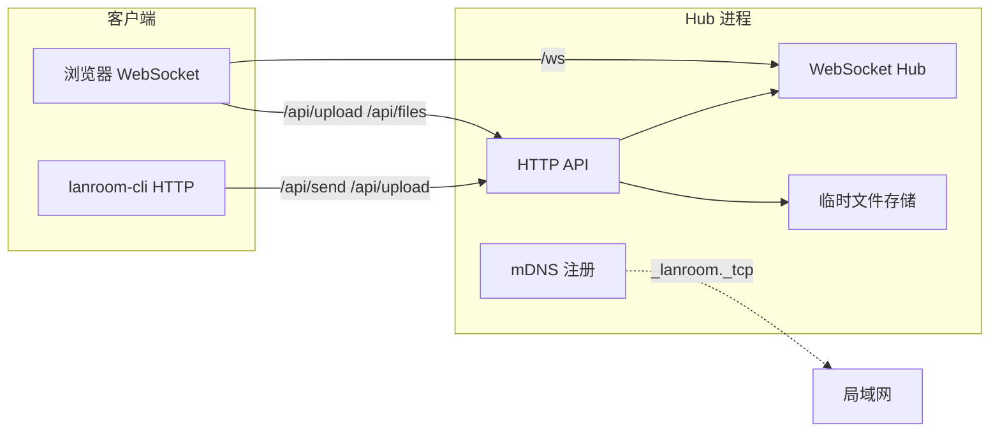

# LanRoom · 局域网聊天式互传

Go 编写的局域网 **Hub + WebSocket 群聊**：Android / Windows / Linux / iOS 只需 **打开浏览器** 即可互传文字、图片与文件，无需安装 App。

支持 mDNS（`http://主机名.local:8787`）、双二维码加入、10 分钟聊天历史、各平台定制 UI，以及 Linux 命令行 `lanroom-cli`。

---

## 目录

- [功能概览](#功能概览)
- [架构说明](#架构说明)
- [环境要求](#环境要求)
- [快速开始](#快速开始)
- [各设备如何加入](#各设备如何加入)
- [Linux 命令行发送](#linux-命令行发送lanroom-cli)
- [Docker 部署](#docker-部署)
- [环境变量](#环境变量)
- [限制与约定](#限制与约定)
- [项目结构](#项目结构)
- [API 参考](#api-参考)
- [各平台说明](#各平台说明)
- [常见问题](#常见问题)
- [本地开发](#本地开发)
- [许可证](#许可证)

---

## 功能概览

| 功能 | 说明 |
|------|------|
| WebSocket 群聊 | 文字消息实时广播 |
| 在线设备列表 | 显示昵称、IP、平台图标 |
| 图片 / 文件 | 先 HTTP 上传，再 WebSocket 广播 `fileId` |
| mDNS | `http://<主机名>.local:8787`，适应 DHCP 换 IP |
| 双二维码 | Android 用局域网 IP；iOS 可用 `.local` |
| 断线重连 | 聊天页内自动重连（离开聊天室不重连） |
| 10 分钟历史 | 新设备加入可回看近期消息 |
| 平台 UI | `platform.css` 按 Android / iOS / Windows / Linux / macOS 切换主题 |
| CLI 发送 | `echo` / `cat` 管道或 `-t` 发文字、发文件 |

---

## 架构说明



**消息流程（浏览器）：**

1. 打开页面 → WebSocket 连接 `/ws?name=...&platform=...`
2. 服务端推送 `welcome`（本设备 ID）、`history`（近期消息）、`presence`（在线列表）
3. 发文字：WebSocket 发送 `{ type: "message", payload: { kind: "text", ... } }`
4. 发文件：先 `POST /api/upload` 获得 `fileId`，再 WebSocket 广播 `kind: "file"` 或 `"image"`

**命令行** 不维持 WebSocket，通过 `POST /api/send` 直接向群聊广播。

---

## 环境要求

| 项目 | 要求 |
|------|------|
| Go | **1.22+**（`go.mod` 可指定更高版本，支持 `GOTOOLCHAIN=auto`） |
| 网络 | 设备在同一局域网，路由器关闭 **AP 隔离** |
| Windows | 防火墙允许入站 **8787**（专用网络） |
| Linux mDNS | 使用 `.local` 或 CLI `LANROOM_HOST=auto` 时需 [Avahi](#linux-前置条件avahi) |

### Linux 前置条件：Avahi

Hub 所在 Linux 若需 `http://主机名.local:8787`、CLI 自动发现或解析 `.local`，须安装 Avahi：

```bash
# Arch Linux
sudo pacman -S avahi
sudo systemctl enable --now avahi-daemon

# Debian / Ubuntu
sudo apt install avahi-daemon
sudo systemctl enable --now avahi-daemon
```

验证（将 `myarch` 换成你的 `hostname`）：

```bash
ping -c 1 myarch.local
avahi-resolve -n myarch.local
```

> Hub 仅本机使用、CLI 用 `127.0.0.1` 时可不装 Avahi。手机加入优先用 **IP 二维码**。

---

## 快速开始

### 1. 进入项目

```bash
cd /path/to/Three_end_transmission
go mod tidy
```

### 2. 启动 Hub

```bash
go run . -port 8787
```

成功日志示例：

```
level=INFO msg="mDNS registered" hostname=myarch url=http://myarch.local:8787
level=INFO msg="hub started" addr=:8787
```

可选：指定 mDNS 主机名（与 `hostname` 不一致时）

```bash
LANROOM_HOSTNAME=myarch go run . -port 8787
```

### 3. 打开浏览器

| 方式 | 地址 |
|------|------|
| mDNS（电脑推荐） | `http://<主机名>.local:8787` |
| 局域网 IP | `http://192.168.x.x:8787` |
| 二维码 | 页面 →「查看连接地址 / 二维码」 |

输入昵称 → **进入聊天室** → 发文字、图片、文件。

### 4. 编译单文件（可选）

```bash
go build -o lanroom .
./lanroom -port 8787
```

---

## 各设备如何加入

连接信息弹窗提供 **两个二维码**，按平台选择：

| 二维码 | 适用 | 地址示例 |
|--------|------|----------|
| **Android · 局域网 IP** | Android、通用 | `http://192.168.117.224:8787` |
| **iOS · .local** | iOS Safari、电脑 | `http://myarch.local:8787` |

**推荐策略：**

- **电脑**：收藏 `http://<主机名>.local:8787`，IP 变了也能用
- **Android**：扫 **IP 二维码** 或手动输入 IP（系统无法解析 `.local`）
- **iOS Safari**：可扫 `.local` 二维码；Chrome 常不行，见 [各平台说明](#各平台说明)

手机若已保存过昵称，可在 URL 加 `?auto=1` 跳过进入页（需本地已有设备名缓存）。

**动态 IP 时：** 在 Hub 机器打开「连接信息」，IP 变了就扫新码；电脑继续用 `.local` 即可。

---

## Linux 命令行发送（lanroom-cli）

浏览器 📎 在部分 Linux 桌面（如 dwm）可能无响应，可用 CLI 代替。

### 编译

```bash
go build -o lanroom-cli ./cmd/lanroom-cli
```

### 用法

```bash
# 发文字
echo "你好" | ./lanroom-cli
./lanroom-cli -t "一条消息"

# 指定 Hub
echo "hello" | ./lanroom-cli -host http://192.168.117.224:8787

# 发文件
./lanroom-cli ./photo.png
cat readme.md | ./lanroom-cli -n readme.md
cat image.png | ./lanroom-cli -file -n image.png

# 自定义发送者名称
./lanroom-cli -name "arch-pc" -t "来自 CLI"
```

### Hub 地址解析顺序

`lanroom-cli` 按以下优先级连接 Hub：

1. `-host` 参数
2. 环境变量 `LANROOM_HOST`
3. mDNS 自动发现（`LANROOM_HOST=auto` 或未设置时的 fallback）
4. `http://127.0.0.1:8787`

```bash
# 推荐：mDNS 域名，IP 变了不用改
export LANROOM_HOST=http://myarch.local:8787

# 自动发现（需 Avahi）
export LANROOM_HOST=auto

# 本机 Hub
export LANROOM_HOST=http://127.0.0.1:8787
```

| `LANROOM_HOST` | 说明 |
|----------------|------|
| `http://主机名.local:8787` | **推荐**，适应动态 IP |
| `http://192.168.x.x:8787` | 固定 IP，换 IP 需更新 |
| `auto` | mDNS 发现局域网 Hub |
| 未设置 | 先自动发现，失败则 `127.0.0.1:8787` |

> 若报 `404 page not found`，可能是连到了 **旧 Hub 进程**（其他端口）。结束旧进程后重启：
>
> ```bash
> pkill -f 'lanroom|three-end-trans'
> go run . -port 8787
> ```

---

## Docker 部署

无需安装 Go，适合 NAS、服务器长期运行。

### 方式 A：Host 网络 + mDNS（动态 IP 推荐）

路由器 DHCP 换 IP 时，仍可用 `http://<主机名>.local:8787` 访问。

**要求：** Linux 宿主机、已装 Avahi、`docker-compose.host.yml`（Mac/Windows Docker Desktop **不支持** host 网络）。

#### 一次性永久配置（推荐）

在 Hub 宿主机执行（只需做一次）：

```bash
cd /path/to/Three_end_transmission
sudo ./deploy/setup-host-mdns.sh myarch
```

脚本会：启用 `avahi-daemon`、安装 `/etc/avahi/services/lanroom.service` 备用发布、提示配置 `nss-mdns`（解析 `*.local`）。

应用内另有 **mDNS Keeper**：启动重试、Wi-Fi 晚就绪自动补注册、DHCP 换 IP 后每 90 秒自动更新。Docker 入口脚本会 **等局域网 IP 就绪** 再启动 Hub。

```bash
cd /path/to/Three_end_transmission

# 若曾用 bridge 模式，先停掉
sudo docker compose down

# 启动（LANROOM_HOSTNAME 与 hostname 一致时可省略）
LANROOM_HOSTNAME=myarch sudo docker compose -f docker-compose.host.yml up -d --build
```

验证：

```bash
ping -c 1 myarch.local
sudo docker compose -f docker-compose.host.yml ps
curl -s http://127.0.0.1:8787/api/info | jq .
```

| 设备 | 访问方式 |
|------|----------|
| 电脑 | `http://myarch.local:8787` |
| 手机 | 连接信息 → 扫 **IP 二维码**（Android）或 **.local 码**（iOS Safari） |
| CLI | `LANROOM_HOST=http://myarch.local:8787 ./lanroom-cli -t "你好"` |

维护：

```bash
sudo docker compose -f docker-compose.host.yml logs -f
sudo docker compose -f docker-compose.host.yml down
LANROOM_HOSTNAME=myarch sudo docker compose -f docker-compose.host.yml up -d --build
```

`restart: unless-stopped` 已配置；配合 `systemctl enable docker` 可开机自启。

### 方式 B：Bridge 端口映射

快速试用；mDNS 在容器内通常不可用，请用 **局域网 IP** 访问。

```bash
docker compose up -d --build
# 浏览器：http://<宿主机 Wi-Fi IP>:8787
```

Bridge 模式下容器内可能是 `172.x` 地址，页面会自动过滤并展示宿主机 LAN IP。也可手动指定：

```bash
LANROOM_ADVERTISE_IP=192.168.117.224 docker compose up -d --build
```

查看 Wi‑Fi IP：`ip -4 addr show wlan0`

自定义端口：

```bash
LANROOM_PORT=8888 docker compose up -d --build
```

### Docker 数据

上传文件保存在卷 `lanroom-uploads`（路径 `/data/uploads`）。**聊天历史在内存中**，Hub 重启后清空；文件记录在 TTL 过期后清理（见 [限制与约定](#限制与约定)）。

---

## 环境变量

### Hub 进程（`go run .` / Docker）

| 变量 | 说明 | 默认 |
|------|------|------|
| `LANROOM_HOSTNAME` | mDNS 注册主机名 | 系统 `hostname`；Docker 未设置时可能跳过 mDNS |
| `LANROOM_ADVERTISE_IP` | 对外展示的局域网 IP（Bridge / 多网卡） | 自动检测网卡 |
| `LANROOM_MAX_UPLOAD_MB` | 单文件上传上限（MiB），默认 `500`，封顶 `4096` | `500` |
| `LANROOM_UPLOAD_DIR` | 上传文件目录 | 系统临时目录下的 `three-end-transmission-uploads` |

### CLI 客户端

| 变量 | 说明 |
|------|------|
| `LANROOM_HOST` | Hub 地址，见 [Hub 地址解析](#hub-地址解析顺序) |

### Docker Compose

| 变量 | 说明 | 默认 |
|------|------|------|
| `LANROOM_PORT` | Bridge 模式宿主机端口 | `8787` |
| `LANROOM_HOSTNAME` | Host 模式 mDNS 名 | `myarch`（见 `docker-compose.host.yml`） |
| `LANROOM_ADVERTISE_IP` | Bridge 模式固定展示 IP | 空 |

---

## 限制与约定

| 项目 | 值 |
|------|-----|
| 默认端口 | `8787`（`internal/config.DefaultPort`） |
| WebSocket 单条消息 | 最大 **512 KB** |
| HTTP `/api/send` 请求体 | 最大 **512 KB** |
| 单文件上传 | 默认 **500 MiB**，可用 `LANROOM_MAX_UPLOAD_MB` 调整（最大 4096） |
| 聊天历史 TTL | **10 分钟**（内存，重启丢失） |
| 上传文件 TTL | **10 分钟**（后台定时清理） |
| 文件 ID | 32 位十六进制 |

Hub 重启后：内存中的聊天历史与文件索引清空；Docker 卷内物理文件可能残留至 TTL 清理。

---

## 项目结构

```
Three_end_transmission/
├── main.go                      # 入口：embed 静态资源、mDNS、HTTP
├── cmd/lanroom-cli/main.go      # 命令行发送工具
├── Dockerfile
├── docker-compose.yml           # Bridge 部署
├── docker-compose.host.yml      # Linux host 网络 + mDNS
├── deploy/
│   ├── setup-host-mdns.sh       # 宿主机一次性 mDNS 配置
│   └── avahi/lanroom.service    # Avahi 备用服务发布
├── scripts/docker-entrypoint.sh # 等 LAN IP 就绪再启动 Hub
├── internal/
│   ├── config/                  # 默认端口等常量
│   ├── hub/                     # WebSocket Hub、协议、平台解析
│   ├── cli/                     # lanroom-cli 客户端逻辑
│   ├── mdns/                    # mDNS 注册与发现
│   └── server/                  # HTTP API、文件上传、网络信息
├── web/
│   ├── index.html
│   └── static/
│       ├── app.js               # 前端逻辑
│       ├── style.css            # 通用样式
│       └── platform.css         # 各平台主题与移动端布局
└── README.md
```

---

## API 参考

### WebSocket `GET /ws`

查询参数：

| 参数 | 说明 |
|------|------|
| `name` | 设备昵称 |
| `platform` | `android` / `ios` / `windows` / `linux` / `macos` / `unknown`（可省略，服务端从 UA 推断） |

**连接后服务端推送：**

```json
{ "type": "welcome", "device": { "id": "...", "name": "...", "platform": "linux", "ip": "192.168.1.2" } }
```

```json
{ "type": "history", "messages": [ /* 近 10 分钟消息 */ ] }
```

```json
{ "type": "presence", "users": [ { "id": "...", "name": "...", "platform": "android", "ip": "..." } ] }
```

**客户端发送消息：**

```json
{
  "type": "message",
  "payload": {
    "kind": "text",
    "content": "你好"
  }
}
```

**服务端广播：**

```json
{
  "type": "message",
  "from": { "id": "...", "name": "Windows PC", "platform": "windows", "ip": "192.168.1.3" },
  "payload": { "kind": "text", "content": "你好" },
  "timestamp": 1710000000
}
```

**文件 / 图片 payload：**

```json
{
  "kind": "file",
  "fileId": "a1b2c3...",
  "meta": { "name": "report.pdf", "size": 1024, "mime": "application/pdf" }
}
```

`kind` 为 `"image"` 时同上，客户端从 `/api/files/{fileId}` 加载图片。

---

### HTTP 接口

| 路径 | 方法 | 说明 |
|------|------|------|
| `/api/info` | GET | 连接信息（IP 列表、mDNS、在线人数） |
| `/api/qrcode` | GET | PNG 二维码，`?url=` 指定内容 |
| `/api/send` | POST | CLI / 脚本发送（JSON） |
| `/api/upload` | POST | `multipart/form-data`，字段 `file` |
| `/api/files/{id}` | GET | 下载已上传文件 |

#### `GET /api/info` 响应示例

```json
{
  "hostname": "myarch",
  "mdnsUrl": "http://myarch.local:8787",
  "joinUrl": "http://192.168.117.224:8787",
  "port": 8787,
  "localIps": ["192.168.117.224"],
  "urls": ["http://192.168.117.224:8787", "http://myarch.local:8787"],
  "clientCount": 2
}
```

#### `POST /api/send` 请求示例

```json
{
  "name": "arch-pc",
  "platform": "linux",
  "payload": {
    "kind": "text",
    "content": "来自 CLI"
  }
}
```

发文件前先 `POST /api/upload` 获得 `fileId`，再：

```json
{
  "name": "arch-pc",
  "platform": "linux",
  "payload": {
    "kind": "file",
    "fileId": "...",
    "meta": { "name": "photo.png", "size": 12345, "mime": "image/png" }
  }
}
```

成功响应：`{ "status": "ok" }`

#### `POST /api/upload` 响应示例

```json
{
  "fileId": "a1b2c3d4e5f6...",
  "name": "photo.png",
  "size": 12345,
  "mime": "image/png"
}
```

---

## 各平台说明

| 平台 | `.local` 域名 | 推荐加入方式 |
|------|---------------|--------------|
| Linux / Windows（Avahi/Bonjour） | ✅ | `http://主机名.local:8787` |
| Android | ❌ | IP 二维码或手动输入 IP |
| iOS Safari | ✅ | `.local` 二维码或 IP |
| iOS Chrome | ❌ | 改用 Safari 或输入 IP |
| Linux CLI | ✅（Avahi） | `LANROOM_HOST=http://主机名.local:8787` |

**Android：** 输入栏固定底部，点 👥 打开设备抽屉；勿开「桌面版网站」。

**iOS：** 可「添加到主屏幕」；剪贴板自动同步受限。

**Linux 桌面：** 消息区隐藏原生滚动条（避免 GTK 白边）；📎 无效时用 `lanroom-cli`。

---

## 常见问题

### 手机扫码后打不开？

- 确认与 Hub **同一 WiFi**（非蜂窝数据）
- Android 请扫 **IP 二维码**，不要用 `.local`
- 关闭路由器 **AP 隔离 / 访客网络**
- 防火墙放行 8787：`sudo ufw allow 8787` 或 `firewall-cmd --add-port=8787/tcp`
- Hub 机器执行 `ss -tlnp | grep 8787` 确认监听

### Docker 连接信息显示 `172.x`？

- 说明用了 **Bridge 模式**，改用 `docker-compose.host.yml`，或直接用 Wi‑Fi IP 访问
- 或设置 `LANROOM_ADVERTISE_IP=<宿主机 LAN IP>`

### `myarch.local` 无法解析或时好时坏？

**若已执行 `deploy/setup-host-mdns.sh` 并重建容器仍失败**，按下面排查：

```bash
systemctl status avahi-daemon
ping -c 1 myarch.local
resolvectl query myarch.local   # 看解析到的是 192.168.x.x 还是 172.x
curl -s http://127.0.0.1:8787/api/info | jq '.mdnsUrl'
```

| 现象 | 处理 |
|------|------|
| `mdnsUrl` 为空 | 重建容器：`LANROOM_HOSTNAME=myarch sudo docker compose -f docker-compose.host.yml up -d --build`；查看日志应有 `mDNS active` |
| 解析到 `172.x` | 旧镜像；重建。或设 `LANROOM_ADVERTISE_IP=192.168.x.x` |
| Avahi 未运行 | `sudo systemctl enable --now avahi-daemon` |
| 开着 Meta/Clash | `/etc/hosts` 备用：执行 `sudo ./deploy/sync-lanroom-hosts.sh`；或关代理 / 放行局域网 |
| Arch 无法解析 | 安装 `nss-mdns`，`nsswitch.conf` 的 `hosts` 行加入 `mdns4_minimal [NOTFOUND=return]` |

Host 模式需 `LANROOM_HOSTNAME` 与 `hostname` 一致。

### Windows 其他设备连不上？

- WiFi 设为 **专用网络**
- 防火墙允许 **8787** 或 `lanroom.exe`

### Linux 上传文件失败？

1. **页面上方是否「已连接」？** 未连接时 WebSocket 发不出去（HTTP 上传成功也不会出现在聊天里）。
2. **dwm 等极简桌面：** 📎 可能弹不出文件选择框 → 用命令行：
   ```bash
   ./lanroom-cli -host http://127.0.0.1:8787 ./你的文件.pdf
   ```
3. **Docker 报 `cannot save file`：** 重建容器（入口脚本会 `chown` 上传目录）：
   ```bash
   LANROOM_HOSTNAME=myarch sudo docker compose -f docker-compose.host.yml up -d --build
   ```
4. **单文件超过上限** 会被拒绝；默认 500 MiB，可在 Hub 环境变量调大（见下）。
5. 刷新页面后重试；仍失败请看浏览器弹窗里的 **HTTP 状态码** 或 `sudo docker logs lanroom --tail 20`。

**调大上传上限（例如 2 GiB）：**

```bash
LANROOM_MAX_UPLOAD_MB=2048 LANROOM_HOSTNAME=myarch \
  sudo docker compose -f docker-compose.host.yml up -d --build
```

`curl -s http://127.0.0.1:8787/api/info | jq .maxUploadMb` 可查看当前生效值。

### 文件存在哪？

- 原生运行：`<系统临时目录>/three-end-transmission-uploads/`
- Docker：卷 `lanroom-uploads` → `/data/uploads`
- 过期或 Hub 重启后索引失效（MVP 行为，未做持久化聊天库）

### 端口被占用？

```bash
ss -tlnp | grep 8787
# 结束占用进程后重启 Hub 或容器
```

---

## 本地开发

```bash
# 运行测试
go test ./...

# 启动开发 Hub
go run . -port 8787

# 构建 CLI
go build -o lanroom-cli ./cmd/lanroom-cli
```

修改 `web/` 下前端文件后需 **重启 Hub**（静态资源通过 `go:embed` 打入二进制）。

---

## 许可证

MIT — 见 [LICENSE](LICENSE)。
