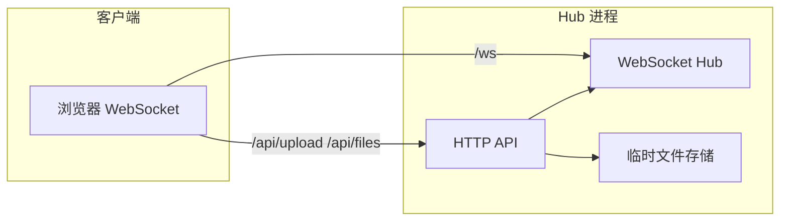

# LanRoom · 局域网聊天式互传

Go 编写的局域网 **Hub + WebSocket 群聊**：Android / Windows / Linux / iOS 只需 **打开浏览器** 即可互传文字、图片与文件，无需安装 App。

以 **局域网 IP** 为唯一加入方式：IP 二维码、10 分钟聊天历史、各平台定制 UI。

---

## 目录

- [功能概览](#功能概览)
- [架构说明](#架构说明)
- [环境要求](#环境要求)
- [快速开始](#快速开始)
- [各设备如何加入](#各设备如何加入)
- [Docker 部署](#docker-部署)
- [环境变量](#环境变量)
- [限制与约定](#限制与约定)
- [项目结构](#项目结构)
- [API 参考](#api-参考)
- [各平台说明](#各平台说明)
- [常见问题](#常见问题)
- [本地开发](#本地开发)
- [许可证](#许可证)

---

## 功能概览

| 功能 | 说明 |
|------|------|
| WebSocket 群聊 | 文字消息实时广播 |
| 在线设备列表 | 显示昵称、IP、平台图标 |
| 图片 / 文件 | 先 HTTP 上传，再 WebSocket 广播 `fileId` |
| IP 二维码 | 全平台通用，扫 `http://192.168.x.x:8787` 加入 |
| 断线重连 | 聊天页内自动重连（离开聊天室不重连） |
| 10 分钟历史 | 新设备加入可回看近期消息 |
| 平台 UI | `platform.css` 按 Android / iOS / Windows / Linux / macOS 切换主题 |

---

## 架构说明



**消息流程（浏览器）：**

1. 打开页面 → WebSocket 连接 `/ws?name=...&platform=...`
2. 服务端推送 `welcome`（本设备 ID）、`history`（近期消息）、`presence`（在线列表）
3. 发文字：WebSocket 发送 `{ type: "message", payload: { kind: "text", ... } }`
4. 发文件：先 `POST /api/upload` 获得 `fileId`，再 WebSocket 广播 `kind: "file"` 或 `"image"`

---

## 环境要求

| 项目 | 要求 |
|------|------|
| Go | **1.22+**（`go.mod` 可指定更高版本，支持 `GOTOOLCHAIN=auto`） |
| 网络 | 设备在同一局域网，路由器关闭 **AP 隔离** |
| Windows | 防火墙允许入站 **8787**（专用网络） |

---

## 快速开始

### 1. 进入项目

```bash
cd /path/to/Three_end_transmission
go mod tidy
```

### 2. 启动 Hub

```bash
go run . -port 8787
```

成功日志示例：

```
level=INFO msg="hub started" addr=:8787 maxUploadMiB=500
```

### 3. 打开浏览器

| 场景 | 地址 |
|------|------|
| 本机 | `http://127.0.0.1:8787` |
| 同网段其他设备 | `http://192.168.x.x:8787` |
| 手机 | 页面 →「查看连接地址 / 二维码」扫码 |

输入昵称 → **进入聊天室** → 发文字、图片、文件。

### 4. 编译单文件（可选）

```bash
go build -o lanroom .
./lanroom -port 8787
```

---

## 各设备如何加入

连接信息弹窗提供 **局域网 IP 二维码**，全平台通用：

| 角色 | 推荐地址 |
|------|----------|
| 手机（全部平台） | 扫 IP 二维码，或手动输入 `http://192.168.x.x:8787` |
| 本机浏览器 | `http://127.0.0.1:8787` |
| 同网段电脑 | `http://192.168.x.x:8787` |

手机若已保存过昵称，可在 URL 加 `?auto=1` 跳过进入页（需本地已有设备名缓存）。

**IP 变了怎么办？** 在 Hub 机器打开「连接信息」，扫新二维码即可。若路由器支持，可为 Hub 机器绑定 **静态 DHCP**，避免频繁换 IP。

---

## Docker 部署

无需安装 Go，适合 NAS、服务器长期运行。

### 方式 A：Host 网络（Linux 推荐）

容器直接使用宿主机网络，自动获取局域网 IP，无需手动设置 `LANROOM_ADVERTISE_IP`。

**要求：** Linux 宿主机、`docker-compose.host.yml`（Mac/Windows Docker Desktop **不支持** host 网络）。

```bash
cd /path/to/Three_end_transmission
sudo docker compose -f docker-compose.host.yml up -d --build
```

验证：

```bash
sudo docker compose -f docker-compose.host.yml ps
curl -s http://127.0.0.1:8787/api/info | jq .
```

| 设备 | 访问方式 |
|------|----------|
| 本机 | `http://127.0.0.1:8787` |
| 手机 / 其他设备 | 连接信息 → 扫 **IP 二维码** |

维护：

```bash
sudo docker compose -f docker-compose.host.yml logs -f
sudo docker compose -f docker-compose.host.yml down
sudo docker compose -f docker-compose.host.yml up -d --build
```

`restart: unless-stopped` 已配置；配合 `systemctl enable docker` 可开机自启。

### 方式 B：Bridge 端口映射

快速试用；请用 **局域网 IP** 访问。

```bash
docker compose up -d --build
# 浏览器：http://<宿主机 Wi-Fi IP>:8787
```

Bridge 模式下容器内可能是 `172.x` 地址，页面会自动过滤并展示宿主机 LAN IP。也可手动指定：

```bash
LANROOM_ADVERTISE_IP=192.168.117.224 docker compose up -d --build
```

查看 Wi‑Fi IP：`ip -4 addr show wlan0`

自定义端口：

```bash
LANROOM_PORT=8888 docker compose up -d --build
```

### Docker 数据

上传文件保存在卷 `lanroom-uploads`（路径 `/data/uploads`）。**聊天历史在内存中**，Hub 重启后清空；文件记录在 TTL 过期后清理（见 [限制与约定](#限制与约定)）。

---

## 环境变量

### Hub 进程（`go run .` / Docker）

| 变量 | 说明 | 默认 |
|------|------|------|
| `LANROOM_ADVERTISE_IP` | 对外展示的局域网 IP（Bridge / 多网卡） | 自动检测网卡 |
| `LANROOM_MAX_UPLOAD_MB` | 单文件上传上限（MiB），默认 `500`，封顶 `4096` | `500` |
| `LANROOM_UPLOAD_DIR` | 上传文件目录 | 系统临时目录下的 `three-end-transmission-uploads` |

### Docker Compose

| 变量 | 说明 | 默认 |
|------|------|------|
| `LANROOM_PORT` | Bridge 模式宿主机端口 | `8787` |
| `LANROOM_ADVERTISE_IP` | Bridge 模式固定展示 IP | 空 |

---

## 限制与约定

| 项目 | 值 |
|------|-----|
| 默认端口 | `8787`（`internal/config.DefaultPort`） |
| WebSocket 单条消息 | 最大 **512 KB** |
| 单文件上传 | 默认 **500 MiB**，可用 `LANROOM_MAX_UPLOAD_MB` 调整（最大 4096） |
| 聊天历史 TTL | **10 分钟**（内存，重启丢失） |
| 上传文件 TTL | **10 分钟**（后台定时清理） |
| 文件 ID | 32 位十六进制 |

Hub 重启后：内存中的聊天历史与文件索引清空；Docker 卷内物理文件可能残留至 TTL 清理。

---

## 项目结构

```
Three_end_transmission/
├── main.go                      # 入口：embed 静态资源、HTTP
├── Dockerfile
├── docker-compose.yml           # Bridge 部署
├── docker-compose.host.yml      # Linux host 网络
├── scripts/docker-entrypoint.sh # 自动检测 LAN IP 后启动 Hub
├── internal/
│   ├── config/                  # 默认端口等常量
│   ├── hub/                     # WebSocket Hub、协议、平台解析
│   ├── netutil/                 # 局域网 IP 检测
│   └── server/                  # HTTP API、文件上传、网络信息
├── web/
│   ├── index.html
│   └── static/
│       ├── app.js               # 前端逻辑
│       ├── style.css            # 通用样式
│       └── platform.css         # 各平台主题与移动端布局
└── README.md
```

---

## API 参考

### WebSocket `GET /ws`

查询参数：

| 参数 | 说明 |
|------|------|
| `name` | 设备昵称 |
| `platform` | `android` / `ios` / `windows` / `linux` / `macos` / `unknown`（可省略，服务端从 UA 推断） |

**连接后服务端推送：**

```json
{ "type": "welcome", "device": { "id": "...", "name": "...", "platform": "linux", "ip": "192.168.1.2" } }
```

```json
{ "type": "history", "messages": [ /* 近 10 分钟消息 */ ] }
```

```json
{ "type": "presence", "users": [ { "id": "...", "name": "...", "platform": "android", "ip": "..." } ] }
```

**客户端发送消息：**

```json
{
  "type": "message",
  "payload": {
    "kind": "text",
    "content": "你好"
  }
}
```

**服务端广播：**

```json
{
  "type": "message",
  "from": { "id": "...", "name": "Windows PC", "platform": "windows", "ip": "192.168.1.3" },
  "payload": { "kind": "text", "content": "你好" },
  "timestamp": 1710000000
}
```

**文件 / 图片 payload：**

```json
{
  "kind": "file",
  "fileId": "a1b2c3...",
  "meta": { "name": "report.pdf", "size": 1024, "mime": "application/pdf" }
}
```

`kind` 为 `"image"` 时同上，客户端从 `/api/files/{fileId}` 加载图片。

---

### HTTP 接口

| 路径 | 方法 | 说明 |
|------|------|------|
| `/api/info` | GET | 连接信息（局域网 IP、加入 URL） |
| `/api/qrcode` | GET | PNG 二维码，`?url=` 指定内容 |
| `/api/upload` | POST | `multipart/form-data`，字段 `file` |
| `/api/files/{id}` | GET | 下载已上传文件 |

#### `GET /api/info` 响应示例

```json
{
  "joinUrl": "http://192.168.117.224:8787",
  "port": 8787,
  "localIps": ["192.168.117.224"],
  "urls": ["http://192.168.117.224:8787"],
  "clientCount": 2,
  "maxUploadMb": 500
}
```

#### `POST /api/upload` 响应示例

```json
{
  "fileId": "a1b2c3d4e5f6...",
  "name": "photo.png",
  "size": 12345,
  "mime": "image/png"
}
```

---

## 各平台说明

| 平台 | 推荐加入方式 |
|------|--------------|
| 全部平台 | 扫 IP 二维码或输入 `http://192.168.x.x:8787` |
| 本机 | `http://127.0.0.1:8787` |

**Android：** 输入栏固定底部，点 👥 打开设备抽屉；勿开「桌面版网站」。

**iOS：** 可「添加到主屏幕」；剪贴板自动同步受限。

**Linux 桌面：** 消息区隐藏原生滚动条（避免 GTK 白边）。

---

## 常见问题

### 手机扫码后打不开？

- 确认与 Hub **同一 WiFi**（非蜂窝数据）
- 扫 **IP 二维码**，或手动输入 `http://192.168.x.x:8787`
- 关闭路由器 **AP 隔离 / 访客网络**
- 防火墙放行 8787：`sudo ufw allow 8787` 或 `firewall-cmd --add-port=8787/tcp`
- Hub 机器执行 `ss -tlnp | grep 8787` 确认监听

### Docker 连接信息显示 `172.x`？

- 说明用了 **Bridge 模式**，改用 `docker-compose.host.yml`，或直接用 Wi‑Fi IP 访问
- 或设置 `LANROOM_ADVERTISE_IP=<宿主机 LAN IP>`

### Windows 其他设备连不上？

- WiFi 设为 **专用网络**
- 防火墙允许 **8787**

### Linux 上传文件失败？

1. **页面上方是否「已连接」？** 未连接时 WebSocket 发不出去（HTTP 上传成功也不会出现在聊天里）。
2. **dwm 等极简桌面：** 📎 可能弹不出文件选择框，可换用带完整文件对话框的浏览器。
3. **Docker 报 `cannot save file`：** 重建容器（入口脚本会 `chown` 上传目录）：
   ```bash
   sudo docker compose -f docker-compose.host.yml up -d --build
   ```
4. **单文件超过上限** 会被拒绝；默认 500 MiB，可在 Hub 环境变量调大（见下）。
5. 刷新页面后重试；仍失败请看浏览器弹窗里的 **HTTP 状态码** 或 `sudo docker logs lanroom --tail 20`。

**调大上传上限（例如 2 GiB）：**

```bash
LANROOM_MAX_UPLOAD_MB=2048 sudo docker compose -f docker-compose.host.yml up -d --build
```

`curl -s http://127.0.0.1:8787/api/info | jq .maxUploadMb` 可查看当前生效值。

### 文件存在哪？

- 原生运行：`<系统临时目录>/three-end-transmission-uploads/`
- Docker：卷 `lanroom-uploads` → `/data/uploads`
- 过期或 Hub 重启后索引失效（MVP 行为，未做持久化聊天库）

### 端口被占用？

```bash
ss -tlnp | grep 8787
# 结束占用进程后重启 Hub 或容器
```

---

## 本地开发

```bash
# 运行测试
go test ./...

# 启动开发 Hub
go run . -port 8787
```

修改 `web/` 下前端文件后需 **重启 Hub**（静态资源通过 `go:embed` 打入二进制）。

---

## 许可证

MIT — 见 [LICENSE](LICENSE)。
